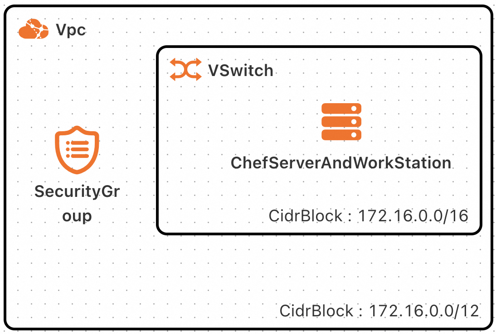
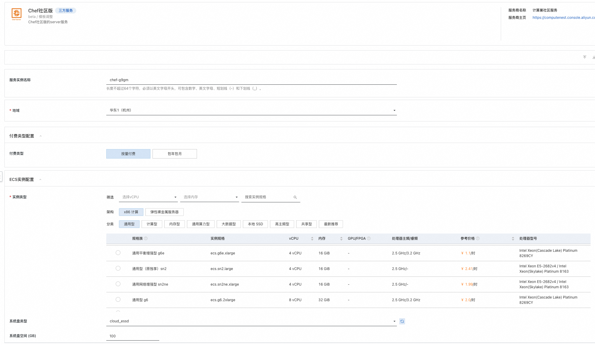
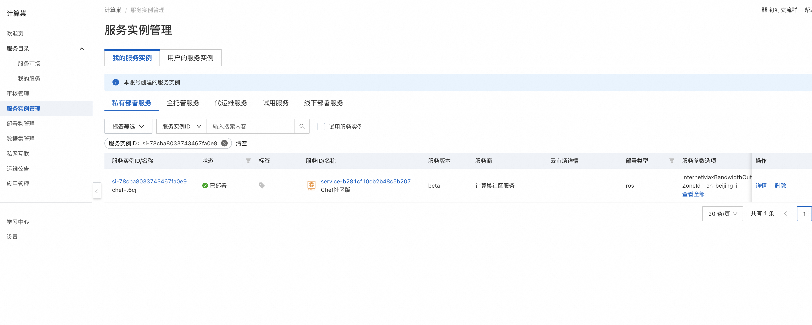
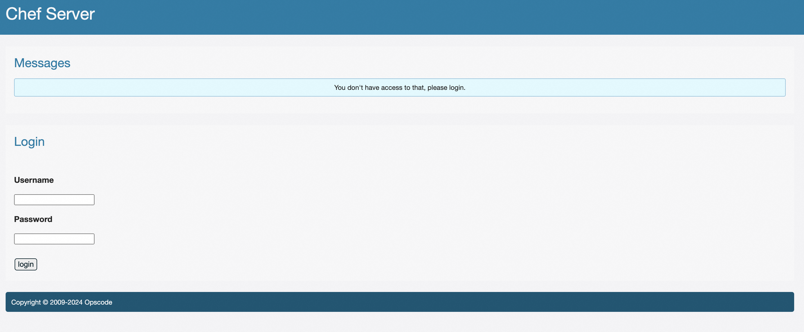
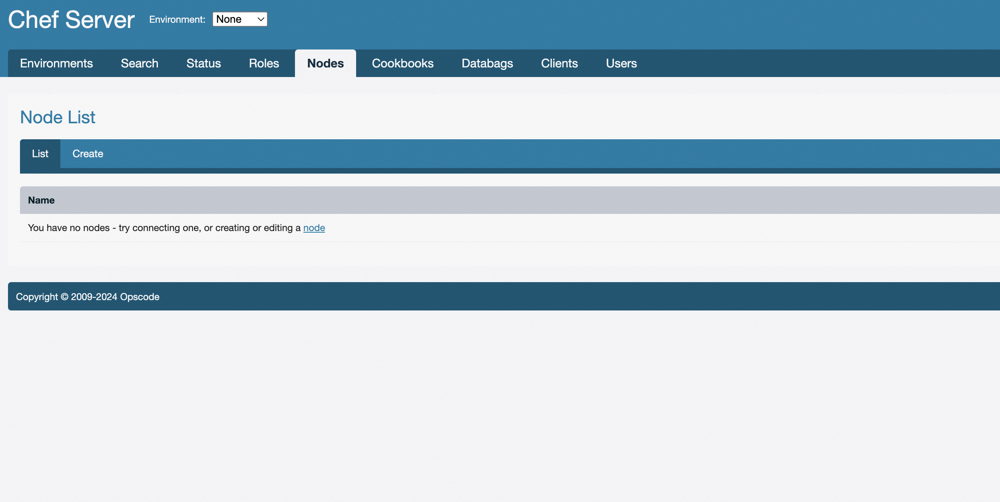

# Chef服务实例部署文档

## 概述

Chef是一款自动化服务器配置管理工具，可以对所管理的对象实行自动化配置，如系统管理，安装软件等。

本文向您介绍如何开通计算巢上的Chef服务，以及部署流程和使用说明。

## 计费说明

在计算巢上的费用主要涉及：

所选 vCPU 与内存规格  

系统盘类型及容量  

公网带宽  

## 部署架构

通过当前计算巢服务，我们将会生产一台ECS并部署Chef的服务端Server以及工作台WorkStation。如果您需要将其他的阿里云ECS纳入当前Chef Server进行管理，则可通过当前服务提供的运维操作实现。

## RAM账号所需权限

Chef服务需要对ECS、VPC等资源进行访问和创建操作，若您使用RAM用户创建服务实例，需要在创建服务实例前，对使用的RAM用户的账号添加相应资源的权限。添加RAM权限的详细操作，请参见[为RAM用户授权](https://help.aliyun.com/document_detail/121945.html)。所需权限如下表所示。

| 权限策略名称 | 备注 |
| --- | --- |
| AliyunECSFullAccess | 管理云服务器服务（ECS）的权限 |
| AliyunVPCReadOnlyAccess | 只读访问专有网络（VPC）的权限 |
| AliyunROSFullAccess | 管理资源编排服务（ROS）的权限 |
| AliyunComputeNestUserFullAccess | 管理计算巢服务（ComputeNest）的用户侧权限 |

## 部署流程

### 部署步骤

单击部署链接，进入服务实例部署界面，根据界面提示，填写参数完成部署。

### 部署参数说明

您在创建服务实例的过程中，需要配置服务实例信息。下文介绍Chef服务实例输入参数的详细信息。

| 参数组 | 参数项 | 示例 | 说明 |
| --- | --- | --- | --- |
| 服务实例名称 |  | test | 实例的名称 |
| 付费类型配置 | 付费类型 | 包年包月 | 按需选择ECS实例的购买方式。按量付费或者包年包月。 |
| 付费类型配置 | 购买资源时长周期 | 月 | 包年包月ECS实例的购买时长单位。 |
| 付费类型配置 | 购买资源时长 | 1 | 包年包月ECS实例的购买时长。 |
| ECS实例配置 | 实例类型 | ecs.g6.large | ECS实例规格，可以根据实际需求选择。 |
| ECS实例配置 | 系统盘类型 | cloud_essd |  |
| ECS实例配置 | 系统盘空间  | 100 |  |
| ECS实例配置 | 流量公网带宽 | 5 |  |
| ECS实例配置 | 实例密码 | xxxx | 登陆ECS实例所用的密码 |
| 网络配置 | 交换机可用区 | cn-beijng-i | |
| 网络配置 | 专有网络VPC实例ID | vpc-xxx | 已有的专有网络ID |
| 网络配置 | 交换机实例ID | vsw-xx | 专有网络下对应的可用区的虚拟交换机 |
| Chef工作台root用户密码 | 新创建的chef server root用户密码 | xxx | Chef服务Server的root用户密码 |

### 验证结果

查看服务实例。服务实例创建成功后，部署时间大约需要2分钟。部署完成后，页面上可以看到对应的服务实例。 

进入到对应的服务实例后，可以在页面上获取ChefServerLoginURL。可通过该URL以root用户登陆Chef server

通过控制台可以对Chef管控的客户端进行操作

### 帮助文档

请访问[Chef用户指南](https://www.w3cschool.cn/doc_chef_11/chef_11-server_12-8-ctl_chef_server.html?lang=en)了解如何使用